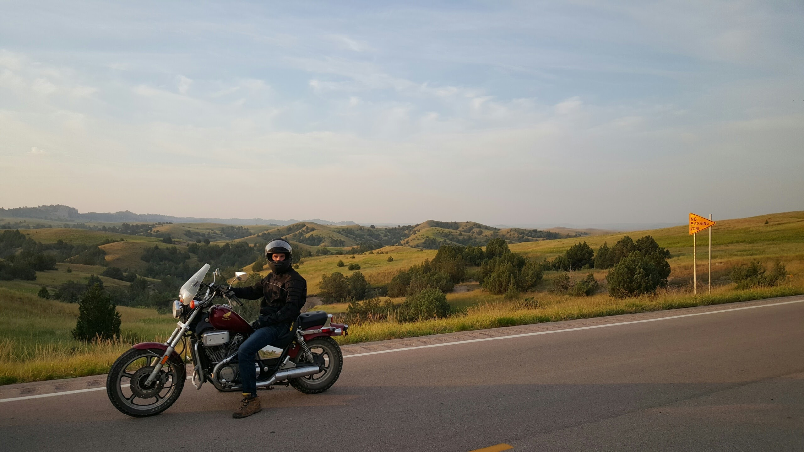
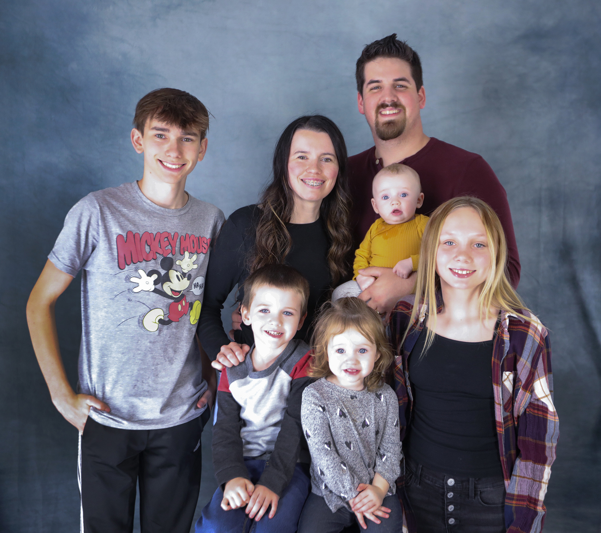

# Introduction

My name is Levi Starrett. I'm a software engineer by day and a family man by
night. My wife Courtney and I met at Purdue and got married in 2016. We live in
historic Lafayette and have a 1 year old son (Ezra). Courtney's two brothers
Nick (14) and Jacob (17) also live with us and attend school in Lafayette. We
are active members of Faith Church and attend Sunday services at the [Northend
Community Center](http://northend.cc).

{: class="picture-left picture-medium"}

I grew up in Brookston, IN and went to high school at Faith Christian School in
Lafayette. I graduated from Purdue in 2016 and accepted a job working for a
small software services company One Fact, Inc.

I love to spend time with my family, work on engineering/maker side projects,
golf, make beer, and outdoor activities when I have time.

I also love motorcycles. Unfortunately, I'm not a current owner, but in 2015 I
was the proud owner of a 1986 Honda Shadow which I rode cross country over 1500
miles from Boulder, CO through Nebraska, South Dakota, Minnesota, Iowa, Illinois
and back home to Lafayette.

---

# Education

### Purdue University

**Bachelor of Science in Computer Science**  
_focus in Systems and Software Engineering_

{: class="picture-right picture-small"}

I graduated from Purdue University with my BS in December of 2016. I took
particular interest in systems topics such as programming languages, compilers,
operating systems, networks, and computer security. While at Purdue, I was a
member of the Undergraduate Student Board for the CS department (USB) and
oversaw the teaching of the student-led CS 190 tools course. In the Fall
semester 2015, I was the main lecturer and wrote all of the labs for CS 190. CS
190 has since become a first class course and has been reassigned as CS 193. I
also worked as a tutor in the CS help room during my time in USB. In the Spring
semester 2016, I worked as a TA with Profs. Hubert Dunsmore and Doug Comer to
launch a new CS course aimed at non-STEM students. CS 101 (Digital Literacy) was
designed to provide a basic level of understanding of computing concepts to
non-technical students in order to equip them to interact in today's world.  I
was a two time CS merit scholarship recipient (2015, 2016) and received the
Exceptional Junior award in 2015.

---

# Career

### Pre-education

My interest in engineering started at a young age working with LEGO. As an
elementary kid I entered a few LEGO robotics competitions building sumo style
robots. When I was in middle school (circa 2007) I wanted to learn how to make a
Facebook app. My dad (who was a software engineer) told me to try to learn
Python. I taught myself Python through a mix of online and physical library
resources. Soon I was getting into the world of graphical interfaces. By this
time, I had turned my attention to building web hosted games. I started using a
free version of Adobe Flash CC to build small games for web hosting (with the
vision of being a flash game designer). About halfway through high school I
started teaching myself Java and built a very simple game engine in Java.

### College

My first year at Purdue I was working as a contractor for a small chemical
instruments company [Emergent
Instruments](http://www.emergentinstruments.com/wp/) which my dad was involved
with. I was doing some web front end work for a device they had in development.
In college I learned that the very artistic side of game and front end
development was not where my passion lay but that my real forte was in the low
level systems programming. In my operating systems class, we worked on a real
time OS called Xinu running on Galileo boards which was one of the highlights of
my time at Purdue. One of my other favorite courses was my computer architecture
course where we got into the nitty gritty of how computers work.

### Qualcomm

I worked as an intern two summers for [Qualcomm
Technologies](https://qualcomm.com). The summer after my freshman year (2014) I
spent at QC headquarters in San Diego. I worked there on a testing team which
was running a dogfooding testing program (QC employees were testing the new
features). My project was a web interface for employees to submit issues. The
application would keep track of the number of issues submitted by each user
along with metrics about how detailed the issue reports were. This data was used
to give each user a score which was available to see and compare through the web
interface. The "winners" would receive prizes. The purpose of this system was to
incentivize the employees to actively test the devices.

The next summer I spent with the modem data protocols team in the
regional office in Boulder, CO. Our group was working on a data protocol called
IWLAN which was a protocol for authenticating over unlicensed spectrum (WiFi) in
order to access carrier-specific services. For example, some carriers bundle
streaming services as part of their plans. When on WiFi, the streaming service
must be able to authenticate a user in order to access that carrier's internal
network. This also enables phone calls over WiFi while maintaining the carrier's
ability to track usage. My project was to implement the FTP protocol on the
device such that we could test data throughput and other factors on a variety of
software and hardware interfaces. This type of work was extremely exciting to
me. I was intending to return to Boulder full time in May 2016, however Qualcomm
was going through some significant downsizing at the time so I was not offered
the position that I would have liked and ended up declining the offer.

### One Fact

In December of 2015 I was searching for full time employment opportunities as I
was scheduled to graduate in May 2016. Another of my dad's companies [One Fact,
Inc](https://onefact.net) had just won a large contract with a new client and
needed to increase staff. They offered me a full time position starting in
January. I would have to drop out of school to work full time, however One Fact
agreed to pay for my final semester if I was able to wait until the Fall term to
finish. I accepted this position and began working full time while staying on at
Purdue part time.

In August 2016, I travelled alone to Cheltenham, UK to deliver a training course
for the tool updates we had been developing since January. I taught a two day
course with about 8 students. In January of 2017 I went to Cheltenham again
with a colleague to deliver the same course.

In January 2017 I went back to full time status after graduating from Purdue and
in February 2017 I was promoted to Senior Software Engineer. In October of 2017
I travelled to Linköping, Sweden with two colleagues where we hosted the 2017
xtUML Days conference. I presented multiple times at this conference.

In July of 2018 I was promoted to Chief Software Architect and began to take a
role as the engineer ultimately responsible for technical design decisions for
software development. I was also responsible for project management and for
developing and enforcing new and existing engineering processes. In October of
2018, I travelled to Copenhagen, Denmark with all three of my colleagues to
attend the MODELS conference where xtUML Days 2018 would be co-located. I
presented a tool demonstration on BridgePoint for the executable modeling
workshop (EXE) where I had used BridgePoint to generate target and software
architecture specific code for Raspberry Pi and Arduino from a single
application model. The model was also demonstrated to run with the same behavior
in a simulated environment within BridgePoint. During that week I also
presented for the xtUML Days track.

At One Fact, I primarily did development work for the open source project
[BridgePoint](https://github.com/xtuml/bridgepoint) (also see
[xtUML.org](https://xtuml.org)). One Fact provides training on usage of xtUML
and BridgePoint, consulting, and support, and accepts feature/bug requests for
BridgePoint users. BridgePoint is a software modeling tool architected as an
Eclipse application. Users build UML models which are executable in a simulated
environment and translatable with model compilers. During my time at one fact, I
gained quite a bit of experience developing Eclipse applications in Java, as
well as experience with developing model compilers including parsers and back
end generators. As a consulting company, I occasionally had the opportunity to
do application modeling myself or work integrating models with target
architectures. I spent quite a bit of time developing examples for training
courses, many times with hardware visual aids. I worked on a two wheeled
balancing robot built on the LEGO Mindstorms EV3 platform running a real time
operating system called [EV3RT](http://ev3rt-git.github.io/about/) by the
[Toppers](https://www.toppers.jp/en/project.html) group.

---

# Projects

TODO

---

# Personal

TODO

{: class="picture-right picture-small"}

---
