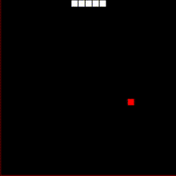

# Introduction

{: class="picture-right picture-small"}

My name is Levi Starrett. I'm a software engineer by day and a family man by
night. My wife Courtney and I met at Purdue and got married in 2016. We live in
historic Lafayette and have a 1 year old son (Ezra). Courtney's two brothers
Nick (14) and Jacob (17) also live with us and attend school in Lafayette. We
are active members of Faith Church and attend Sunday services at the [Northend
Community Center](http://northend.cc).

{: class="picture-left picture-medium"}

I grew up in Brookston, IN and went to high school at Faith Christian School in
Lafayette. I graduated from Purdue in 2016 and accepted a job working for a
small software services company One Fact, Inc.

I'm passionate about computer science, teaching, and generally getting young
people interested in engineering and creative crafts. I love getting "down on
the iron" and working with prototyping boards and other forms of DIY computer
hardware. I have some experience with robotics (mostly LEGO) and enjoy the
challenge of encoding behavior for devices that can be seen and touched. I have
a membership at the MatchBOX Studio in Lafayette and have been learning how to
use some of the Maker Lab equipment (mostly laser cutting).

I love to spend time with my family, work on engineering/maker side projects,
golf, make beer, and outdoor activities when I have time.

I also love motorcycles. Unfortunately, I'm not a current owner, but in 2015 I
was the proud owner of a 1986 Honda Shadow which I rode cross country over 1500
miles from Boulder, CO through Nebraska, South Dakota, Minnesota, Iowa, Illinois
and back home to Lafayette.

---

# Education

## Purdue University
### Bachelor of Science in Computer Science
**_focus in Systems and Software Engineering_**

{: class="picture-right picture-small"}

I graduated from Purdue University with my BS in December of 2016. I took
particular interest in systems topics such as programming languages, compilers,
operating systems, networks, and computer security. While at Purdue, I was a
member of the Undergraduate Student Board for the CS department (USB) and
oversaw the teaching of the student-led CS 190 tools course. In the Fall
semester 2015, I was the main lecturer and wrote all of the labs for CS 190. CS
190 has since become a first class course and has been reassigned as CS 193. I
also worked as a tutor in the CS help room during my time in USB. In the Spring
semester 2016, I worked as a TA with Profs. Hubert Dunsmore and Doug Comer to
launch a new CS course aimed at non-STEM students. CS 101 (Digital Literacy) was
designed to provide a basic level of understanding of computing concepts to
non-technical students in order to equip them to interact in today's world.  I
was a two time CS merit scholarship recipient (2015, 2016) and received the
Exceptional Junior award in 2015.

---

# Career

## Pre-education

_Billy and Bob: A flash game I wrote_
{: class="picture-left picture-small"}

My interest in engineering started at a young age working with LEGO. As an
elementary kid I entered a few LEGO robotics competitions building sumo style
robots. When I was in middle school (circa 2007) I wanted to learn how to make a
Facebook app. My dad (who was a software engineer) told me to try to learn
Python. I taught myself Python through a mix of online and physical library
resources. Soon I was getting into the world of graphical interfaces. By this
time, I had turned my attention to building web hosted games. I started using a
free version of Adobe Flash CC to build small games for web hosting (with the
vision of being a flash game designer). About halfway through high school I
started teaching myself Java and built a very simple game engine in Java.

## College

My first year at Purdue I was working as a contractor for a small chemical
instruments company [Emergent
Instruments](http://www.emergentinstruments.com/wp/) which my dad was involved
with. I was doing some web front end work for a device they had in development.
In college I learned that the very artistic side of game and front end
development was not where my passion lay but that my real forte was in the low
level systems programming. In my operating systems class, we worked on a real
time OS called Xinu running on Galileo boards which was one of the highlights of
my time at Purdue. One of my other favorite courses was my computer architecture
course where we got into the nitty gritty of how computers work.

## Qualcomm

{: class="picture-right picture-small"}

I worked as an intern two summers for [Qualcomm
Technologies](https://qualcomm.com). The summer after my freshman year (2014) I
spent at QC headquarters in San Diego. I worked there on a testing team which
was running a dogfooding testing program (QC employees were testing the new
features). My project was a web interface for employees to submit issues. The
application would keep track of the number of issues submitted by each user
along with metrics about how detailed the issue reports were. This data was used
to give each user a score which was available to see and compare through the web
interface. The "winners" would receive prizes. The purpose of this system was to
incentivize the employees to actively test the devices.

The next summer I spent with the modem data protocols team in the
regional office in Boulder, CO. Our group was working on a data protocol called
IWLAN which was a protocol for authenticating over unlicensed spectrum (WiFi) in
order to access carrier-specific services. For example, some carriers bundle
streaming services as part of their plans. When on WiFi, the streaming service
must be able to authenticate a user in order to access that carrier's internal
network. This also enables phone calls over WiFi while maintaining the carrier's
ability to track usage. My project was to implement the FTP protocol on the
device such that we could test data throughput and other factors on a variety of
software and hardware interfaces. This type of work was extremely exciting to
me. I was intending to return to Boulder full time in May 2016, however Qualcomm
was going through some significant downsizing at the time so I was not offered
the position that I would have liked and ended up declining the offer.

## One Fact

In December of 2015 I was searching for full time employment opportunities as I
was scheduled to graduate in May 2016. Another of my dad's companies [One Fact,
Inc](https://onefact.net) had just won a large contract with a new client and
needed to increase staff. They offered me a full time position starting in
January. I would have to drop out of school to work full time, however One Fact
agreed to pay for my final semester if I was able to wait until the Fall term to
finish. I accepted this position and began working full time while staying on at
Purdue part time.

In August 2016, I travelled alone to Cheltenham, UK to deliver a training course
for the tool updates we had been developing since January. I taught a two day
course with about 8 students. In January of 2017 I went to Cheltenham again
with a colleague to deliver the same course.

{: class="picture-left picture-small"}

In January 2017 I went back to full time status after graduating from Purdue and
in February 2017 I was promoted to Senior Software Engineer. In October of 2017
I travelled to Linköping, Sweden with two colleagues where we hosted the 2017
xtUML Days conference. I presented multiple times at this conference.

In July of 2018 I was promoted to Chief Software Architect and began to take a
role as the engineer ultimately responsible for technical design decisions for
software development. I was also responsible for project management and for
developing and enforcing new and existing engineering processes. In October of
2018, I travelled to Copenhagen, Denmark with all three of my colleagues to
attend the MODELS conference where xtUML Days 2018 would be co-located. I
presented a tool demonstration on BridgePoint for the executable modeling
workshop (EXE) where I had used BridgePoint to generate target and software
architecture specific code for Raspberry Pi and Arduino from a single
application model. The model was also demonstrated to run with the same behavior
in a simulated environment within BridgePoint. During that week I also
presented for the xtUML Days track.

At One Fact, I primarily did development work for the open source project
[BridgePoint](https://github.com/xtuml/bridgepoint) (also see
[xtUML.org](https://xtuml.org)). One Fact provides training on usage of xtUML
and BridgePoint, consulting, and support, and accepts feature/bug requests for
BridgePoint users. BridgePoint is a software modeling tool architected as an
Eclipse application. Users build UML models which are executable in a simulated
environment and translatable with model compilers. During my time at one fact, I
gained quite a bit of experience developing Eclipse applications in Java, as
well as experience with developing model compilers including parsers and back
end generators. As a consulting company, I occasionally had the opportunity to
do application modeling myself or work integrating models with target
architectures. I spent quite a bit of time developing examples for training
courses, many times with hardware visual aids. I worked on a two wheeled
balancing robot built on the LEGO Mindstorms EV3 platform running a real time
operating system called [EV3RT](http://ev3rt-git.github.io/about/) by the
[Toppers](https://www.toppers.jp/en/project.html) group.

---

# Projects

## ciera model compiler

In early 2017 I started work on a side project to create a new model compiler to
generate Java from xtUML models. My original goal for this project was to
experiment with some concepts I had been thinking about to create a model
compiler that is itself modeled in xtUML. Since then, the goals have pivoted and
I hope to use it to generate production applications and to use it to generate
code for BridgePoint and other tools.

xtUML is a graphical and textual modeling language that supports modeling with
the [Shlaer-Mellor method](https://en.wikipedia.org/wiki/Shlaer–Mellor_method).
xtUML is stored on disk as a mix of SQL instances in plaintext files and plain
text. The structural and graphical elements in the language are stored as SQL
"INSERT" statements, and the action language is Object Action Language (OAL)
stored as text. xtUML can be executed interpretively by a simulator and it can
be translated to any number of target languages/software architectures.

The ciera project is still in progress (homepage for the project coming soon!)
but at the moment, it is feature complete enough to generate and run real
applications including the GPS Watch example (see the [next
section](#gps-watch-demo-application)). The project uses Maven as a build
environment and is completely modeled and built with a version of itself. Some
preliminary work has been done to generate distributed AWS applications from
models. I am looking forward to developing this project more in the future.

## GPS Watch demo application

<iframe src="https://www.youtube.com/embed/TLFNod4Qvnw" frameborder="0"
allow="accelerometer; autoplay; encrypted-media; gyroscope; picture-in-picture"
allowfullscreen></iframe>

One of the best example xtUML models we have is that of a GPS running watch. We
use this model all the time for training and teaching xtUML. It has complex
enough behavior to be interesting, and yet it is very easy to understand. It
has a nice graphical interface which makes it very visual. In the Spring of
2018, we converted the GPS Watch example model to MASL in order to test some
usability requirements for the MASL editing tools (see [Raven](#raven)). Ahead
of the MODELS conference (Oct. 2018) I prepared a presentation demonstrating
how BridgePoint could be used to re-target applications for different
languages, software and hardware architectures. To prove my point, I generated
code using our C model compiler (MC-3020) for an Arduino UNO. The MC-3020
architecture is designed to produce very small, compact ANSI C with no
dependencies. This software architecture is perfect for generating complex
stateful applications for deployment on hardware targets with no HLOS. In the
case of the Arduino, only 2K of RAM was available for the application. I also
generated code from the MASL version of the GPS Watch application using the
MASL model compiler.  This software architecture targets C++ on Linux systems.
The architecture has dynamic memory allocation and persistent storage, and
includes features which allow libraries to be dynamically loaded so an
inspector application can interrogate the state of the application without
bringing the application down. This architecture is perfect for long running
applications distributed across many nodes. The generated code was deployed on a
Raspberry Pi 3 B+ running Raspbian. The video shows that both hardware platforms
and the simulator exhibit identical behavior despite vast differences in
software and hardware used. The presentation I gave at MODELS can be accessed
[here](assets/images/1-3-5.pdf).

<iframe src="https://www.youtube.com/embed/nY984Yev5GI" frameborder="0"
allow="accelerometer; autoplay; encrypted-media; gyroscope; picture-in-picture"
allowfullscreen></iframe>

Later, in November of 2018 I extended the demo to include an experimental
version of my [ciera architecture](#ciera-model-compiler) which generated an
asynchronous application to AWS. This was for a "lunch and learn" event that one
of my colleagues was presenting for Northrup-Grumman in the UK. The application
was deployed as a AWS Lambda function. On a regular interval, the Lambda would
be triggered at which time it would load the instance population from a DynamoDB
backend including running timers and "in-flight" events. It would then check if
any timers had expired and handle events until the application quiesced. At that
point, the state would be persisted to the database and the Lambda would exit.
This architecture provides a highly powerful and scalable platform. The demo
never worked exactly how it should, but this architecture is still a work in
progress. The presentation given at the lunch and learn can be accessed
[here](assets/images/GPSCiera.pdf).

## BridgePoint

Since I started with One Fact, I have been one of the core committers to the
[BridgePoint project](https://github.com/xtuml/bridgepoint) and the
[BridgePoint model compilers](https://github.com/xtuml/mc). As stated above,
BridgePoint is an open source tool built on the Eclipse Oxygen platform.
BridgePoint was not always an open source tool and it was not always
Eclipse-based. Because of the long history of the code base, there has been a
lot of maintenance and revitalizing work I have done with the project. As Chief
Software Architect, it is my responsibility to lead BridgePoint into the
technical future and assure its long term maintainability. I have worked to
remove unnecessary complexity and produce a more nimble, more lean product which
is in the end less expensive to support. I have also worked on the build of
BridgePoint itself including work on setting up a Jenkins build server to allow
us to build BridgePoint and run unit tests more then we ever have before.

During my work on the BridgePoint project, I have implemented several notable
features:

#### Raven

I was a core developer during the Raven project which added tooling to
support the MASL modeling language. MASL is a textual language that supports
software modeling with the [Shlaer-Mellor
method](https://en.wikipedia.org/wiki/Shlaer–Mellor_method) as described in
_Model Driven Architecture with Executable UML_ ([Chris Raistrick; et al.
2004](https://www.cambridge.org/vi/academic/subjects/engineering/engineering-mathematics-and-programming/model-driven-architecture-executable-uml?format=WW&isbn=9780521537711)).
The Raven project introduced the capability of BridgePoint to convert MASL
models to xtUML, import them, edit them, and export them as MASL models for
compilation later in the build chain.

#### CLI redesign

During the Raven project, we developed a testing tool we called MASL round trip.
Many of our clients work in military contracting so they are often unable to
share their models with us for testing purposes as they are classified. We must
develop creative ways to test our work without access to large repositories of
source models. MASL round trip was an automated test which exercised the MASL
tools in BridgePoint and produced a report. The test was built with several
scripts and depended on the BridgePoint CLI to perform certain operations. Since
BridgePoint is an Eclipse application, the CLI launches the Eclipse workbench
which can take some time when many hundreds of operations are performed. In
spring of 2017 I worked on the CLI to improve the way we do things allowing a
single instance of the Eclipse workbench to be instantiated for a series of
commands. When this feature was deployed to our customer, the time required to
run their full suite of 575 test models went from 10+ hours down to ~40 minutes.

#### Completion assist

<iframe src="https://www.youtube.com/embed/lmZJ44ceDD8" frameborder="0"
allow="accelerometer; autoplay; encrypted-media; gyroscope; picture-in-picture"
allowfullscreen></iframe>

In 2017 I implemented completion assistance for the OAL editor within
BridgePoint. This ended up being the most important feature of the year and
helped BridgePoint users be much more efficient. In this video two editors are
"racing" to implement an operation. The top does not have the content assist
feature, but the bottom does.

#### Set operations

Another OAL feature I worked on was implementation of set operators for set
arithmetic. In Spring of 2018 I implemented the feature which added operations
union, disunion, difference, and symmetric difference. These were supported by
the model verifier (simulator) and all of our model compilers

#### Project Primus

In Winter 2018, I lead the Project Primus project. In this project we
implemented a new model element "Deployments", used for some types of system
modeling. I lead the management of this project from start to finish including
initial analysis and proposal, requirements specification, project sizing and
schedule, implementation, review, and documentation update.

## Snake

{: class="picture-left picture-small"}

Over the summer of 2014 while at Qualcomm in San Diego, I wrote a web based
version of the game "snake". I had a nostalgic connection to this game because I
used to play it all the time on my dad's Nokia cell phone on the way to school.
My implementation attempts to emulate the same blocky aesthetic but bring a
fresh take on the color scheme. At the time, I was learning about responsive web
design while I was working on the testing web interface for Qualcomm. The snake
game is designed to be compatible with mobile devices visually, and it is also
made to be compatible with touch screens. On desktop, the arrow keys are used,
but on mobile, a touch pad is provided.

I also was interested in writing strategy algorithms for the game. I didn't get
too far creating intelligent algorithms, however I designed the game such that
new cheat algorithms could easily be plugged in.

The game homepage can be found [here](https://leviathan747.github.io/snake).

## Expression parser

I wrote a small expression parser that can be used to perform simple arithmetic
calculations from the command line. This was a simple one day project that I
found fun as it gave me an opportunity to practice designing good a good parser
which encoded order of operations.

The project can be found on Github
[here](https://github.com/leviathan747/expression).

---

